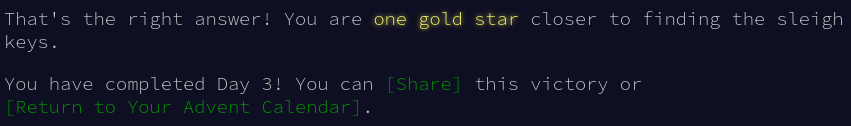

# [Day 3](https://adventofcode.com/2021/day/3): Binary Diagnostic

## Parte 1

1. Problem

	The submarine has been making some odd creaking noises, so you ask it to produce a diagnostic report just in case.

	The diagnostic report (your puzzle input) consists of a list of binary numbers which, when decoded properly, can tell you many useful things about the conditions of the submarine. The first parameter to check is the **power consumption**.

	You need to use the binary numbers in the diagnostic report to generate two new binary numbers (called the **gamma rate** and the **epsilon rate**). The power consumption can then be found by multiplying the gamma rate by the epsilon rate.

	Each bit in the gamma rate can be determined by finding the **most common bit in the corresponding position** of all numbers in the diagnostic report. For example, given the following diagnostic report:

	```sh
	00100
	11110
	10110
	10111
	10101
	01111
	00111
	11100
	10000
	11001
	00010
	01010
	```

	Considering only the first bit of each number, there are five 0 bits and seven 1 bits. Since the most common bit is 1, the first bit of the gamma rate is 1.

	The most common second bit of the numbers in the diagnostic report is 0, so the second bit of the gamma rate is 0.

	The most common value of the third, fourth, and fifth bits are 1, 1, and 0, respectively, and so the final three bits of the gamma rate are 110.

	So, the gamma rate is the binary number 10110, or 22 in decimal.

	The epsilon rate is calculated in a similar way; rather than use the most common bit, the least common bit from each position is used. So, the epsilon rate is 01001, or 9 in decimal. Multiplying the gamma rate (22) by the epsilon rate (9) produces the power consumption, 198.

	Use the binary numbers in your diagnostic report to calculate the gamma rate and epsilon rate, then multiply them together. **What is the power consumption of the submarine?** (Be sure to represent your answer in decimal, not binary.)

2. [Input](https://adventofcode.com/2021/day/3/input)

3. `codigo.cpp`

	```cpp
	#include<iostream>
	#include<vector>
	#include<cstdio>
	#include<algorithm>
	#include<math.h>
	using namespace std;
	vector<vector<int> > transpose(const vector<vector<int> > &b){
	    vector<vector<int> > trans_vec(b[0].size(), vector<int>());
	    for (int i = 0; i < b.size(); i++){
		for (int j = 0; j < b[i].size(); j++){
		    trans_vec[j].push_back(b[i][j]);
		}
	    }
	    return trans_vec;
	}
	int a,t=0,fila;
	int main(){
		vector< vector<int> > v1,v2;
		vector<int> row;
		//numero de digitos por fila
		fila=12;
		//input
		while(scanf("%1d",&a) != EOF){
			t++;
			row.push_back(a);
			if(t%fila==0){v1.push_back(row);row.clear();}
		}
		//transpose, matriz transpuesta
		v2=transpose(v1);
		//gamma=mayor cantidad
		vector<int> gamma;
		int plus=0;
		for (int i=0;i<v2.size();i++){
			plus++;
			int n1=count(v2[i].begin(),v2[i].end(),1);
			int n0=count(v2[i].begin(),v2[i].end(),0);
			if(n1>=n0){gamma.push_back(1);}
			else{gamma.push_back(0);}
		}
		//gamma a entero
		int g=0;
		for (int i = (gamma.size()-1);i>=0; i--){
			g+=gamma[i]*pow(2,(gamma.size()-i-1));
		}
		//power consumption
		int total=pow(2,gamma.size())-1,e=total-g;
		cout<<g*e<<endl;
		return 0;
	}
	```
4. Answer: 3277364

	

## [Parte 2](https://adventofcode.com/2021/day/3#part2)

1. Problem

	Next, you should verify the **life support rating**, which can be determined by multiplying the **oxygen generator rating** by the **CO2 scrubber rating**.

	Both the oxygen generator rating and the CO2 scrubber rating are values that can be found in your diagnostic report - finding them is the tricky part. Both values are located using a similar process that involves filtering out values until only one remains. Before searching for either rating value, start with the full list of binary numbers from your diagnostic report and **consider just the first bit** of those numbers. Then:

	* Keep only numbers selected by the **bit criteria** for the type of rating value for which you are searching. Discard numbers which do not match the bit criteria.
	* If you only have one number left, stop; this is the rating value for which you are searching.
	* Otherwise, repeat the process, considering the next bit to the right.

	The **bit criteria** depends on which type of rating value you want to find:

	* To find **oxygen generator rating**, determine the **most common** value (0 or 1) in the current bit position, and keep only numbers with that bit in that position. If 0 and 1 are equally common, keep values with a 1 in the position being considered.
	* To find **CO2 scrubber rating**, determine the **least common** value (0 or 1) in the current bit position, and keep only numbers with that bit in that position. If 0 and 1 are equally common, keep values with a 0 in the position being considered.

	For example, to determine the **oxygen generator rating** value using the same example diagnostic report from above:

	* Start with all 12 numbers and consider only the first bit of each number. There are more 1 bits (7) than 0 bits (5), so keep only the 7 numbers with a 1 in the first position: 11110, 10110, 10111, 10101, 11100, 10000, and 11001.
	* Then, consider the second bit of the 7 remaining numbers: there are more 0 bits (4) than 1 bits (3), so keep only the 4 numbers with a 0 in the second position: 10110, 10111, 10101, and 10000.
	* In the third position, three of the four numbers have a 1, so keep those three: 10110, 10111, and 10101.
	* In the fourth position, two of the three numbers have a 1, so keep those two: 10110 and 10111.
	* In the fifth position, there are an equal number of 0 bits and 1 bits (one each). So, to find the **oxygen generator rating**, keep the number with a 1 in that position: 10111.
	* As there is only one number left, stop; the **oxygen generator rating** is 10111, or 23 in decimal.

	Then, to determine the **CO2 scrubber rating** value from the same example above:

	* Start again with all 12 numbers and consider only the first bit of each number. There are fewer 0 bits (5) than 1 bits (7), so keep only the 5 numbers with a 0 in the first position: 00100, 01111, 00111, 00010, and 01010.
	* Then, consider the second bit of the 5 remaining numbers: there are fewer 1 bits (2) than 0 bits (3), so keep only the 2 numbers with a 1 in the second position: 01111 and 01010.
	* In the third position, there are an equal number of 0 bits and 1 bits (one each). So, to find the **CO2 scrubber rating**, keep the number with a 0 in that position: 01010.
	* As there is only one number left, stop; the **CO2 scrubber rating** is 01010, or 10 in decimal.

	Finally, to find the life support rating, multiply the oxygen generator rating (23) by the CO2 scrubber rating (10) to get **230**.

	Use the binary numbers in your diagnostic report to calculate the oxygen generator rating and CO2 scrubber rating, then multiply them together. **What is the life support rating of the submarine?** (Be sure to represent your answer in decimal, not binary.)


2. [Input](https://adventofcode.com/2021/day/3/input)

3. `codigo.cpp`

	```cpp
	#include<iostream>
	#include<vector>
	#include<cstdio>
	#include<algorithm>
	#include<math.h>
	using namespace std;
	vector<vector<int> > transpose(const vector<vector<int> > &b){
	    vector<vector<int> > trans_vec(b[0].size(), vector<int>());
	    for (int i = 0; i < b.size(); i++){
		for (int j = 0; j < b[i].size(); j++){
		    trans_vec[j].push_back(b[i][j]);
		}
	    }
	    return trans_vec;
	}
	int masComun(int posicion, const vector<vector<int> > &b){
		vector< vector<int> > c;
		c=transpose(b);
		int n1=count(c[posicion].begin(),c[posicion].end(),1);
		int n0=count(c[posicion].begin(),c[posicion].end(),0);
		if(n1>=n0)	return 1;
		else		return 0;
	}
	int menosComun(int posicion, const vector<vector<int> > &b){
		vector< vector<int> > c;
		c=transpose(b);
		int n1=count(c[posicion].begin(),c[posicion].end(),1);
		int n0=count(c[posicion].begin(),c[posicion].end(),0);
		if(n0<=n1)	return 0;
		else		return 1;
	}
	vector<vector<int> > eliminar(int n,int posicion, const vector<vector<int> > &b){
		vector< vector<int> > c;
		for(int i=0;i<b.size();i++){
			if(b[i][posicion]==n)	c.push_back(b[i]);
		}
		return c;
	}
	vector<vector<int> > purgandoMasComun(int posicion, const vector<vector<int> > &b){
		vector< vector<int> > c;
		c=eliminar(masComun(posicion,b),posicion,b);
		return c;
	}
	vector<vector<int> > purgandoMenosComun(int posicion, const vector<vector<int> > &b){
		vector< vector<int> > c;
		c=eliminar(menosComun(posicion,b),posicion,b);
		return c;
	}
	vector<vector<int> > OxygenGeneratorRating(vector<vector<int> > &b){
		int repetir=b[0].size();
		vector< vector<int> > c;
		bool a=true;
		for(int i=0;i<repetir;i++){
			if(b.size()>1){
				c=purgandoMasComun(i,b);
				b=c;
			}else{a=false;}
		}
		return b;
	}
	vector<vector<int> > CO2ScrubberRating(vector<vector<int> > &b){
		int repetir=b[0].size();
		vector< vector<int> > c;
		bool a=true;
		for(int i=0;i<repetir && a;i++){
			if(b.size()>1){
				c=purgandoMenosComun(i,b);
				b=c;
			}else{a=false;}
		}
		return b;
	}
	int BinarioEntero(vector<vector<int> > &b){
		int g=0;
		for (int i = (b[0].size()-1);i>=0; i--){
			g+=b[0][i]*pow(2,(b[0].size()-i-1));
		}
		return g;
	}
	int main(){
		int a,t=0,fila;
		vector< vector<int> > v1,v2,v3,x1,x2;
		vector<int> row;
		fila=12;
		while(scanf("%1d",&a) != EOF){
			t++;
			row.push_back(a);
			if(t%fila==0){v1.push_back(row);row.clear();}
		}
		x1=v1;x2=v1;
		v2=OxygenGeneratorRating(x2);
		v3=CO2ScrubberRating(x1);
		cout<<BinarioEntero(v2)*BinarioEntero(v3)<<endl;
		return 0;
	}
	```

4. Answer: 5736383 

	
